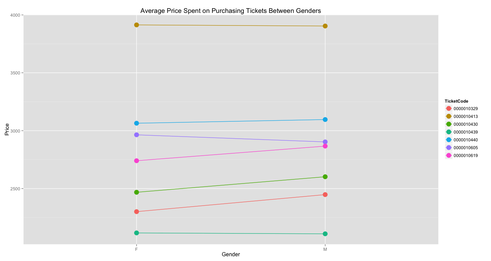
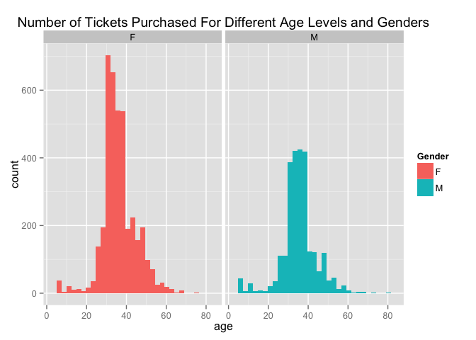
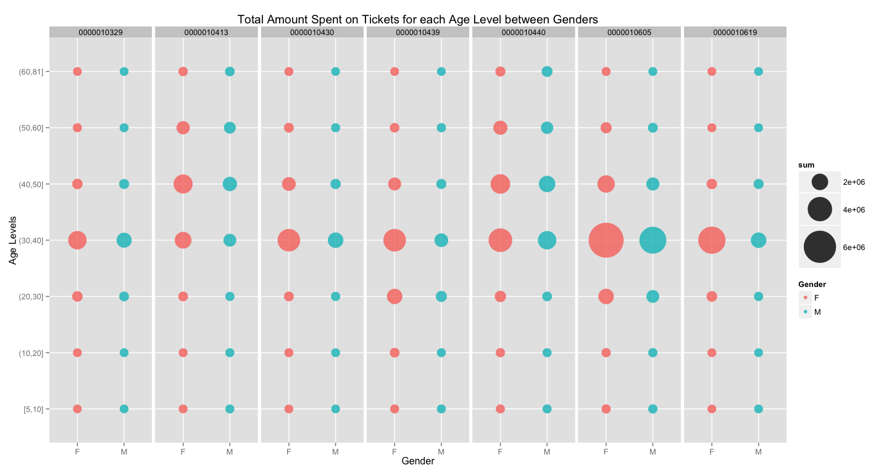

# Ticket System Data Analysis

## I. Data Description
This dataset used for this report is the ticket selling record for a ticket system for January to April. It consists of 221722 observations and 13 variables. The column names are already quite descriptive of what each variables stands for so detailed-explanation will not be included. However, there are a couple of things that may need some explaining.

- `TicketCode` With you want to aggregate the data of the same concert you should do it by using this column. Do not use the `TicketName` column, they might be different for the same concert due to marketing reasons ( making the name look cuter promotes sales...? ). 
- `TicketSiteCode` The Code 88888 tells us that the ticket was sold by online platform, while all the other code represents different physical channel ( e.g. convenience stores, bookstores etc. ).
- For `Gender` and `BirthYear` column, unless the column `TicketSiteCode` is 88888 for that corresponding row, then the values for these two columns will have no meaning. THe values that appears for the data cell is just the default value. Therefore, if you want to conduct analysis based on the sex and age of the consumers, you should only include the observations where its `TicketSiteCode` is 88888.
- To preprocess the correct time for which the ticket was bought requires combining the Year, Month, Date part from the `SoldDate` column and Hour, Minute, Second from the `SoldTime` column. The original database somehow messed up the two column and splitted to two parts.  
- `SoldPrice` The actual sold price of the ticket might be different to the original price due to reasons such as the member being a VIP member of the ticket system or the ticket site was giving out discounts if the tickets were purchase at those specific sites. Another reason is that the tickets were given for out for free ( will be recorded as 0 or 10 for the tax in the data cell ).
- `URL` Adding http://www.ticket.com.tw/ before the url should lead you to the correct website.

## II. Environment Setting 

```r
# load library
library(ggplot2)
library(data.table)
suppressMessages( library(dplyr) )
suppressMessages( library(lubridate) )
# set time
Sys.setlocale("LC_TIME", "English")
# set working directory
setwd("C:/Users/ASUS/ticket-system/system")
# read in the files
files <- list.files( "data", full.names = TRUE )
data  <- fread( files, stringsAsFactors = FALSE, header = TRUE, sep = ",", 
                colClasses = "character" )
```

## III. Exploratory Data Analysis

The section exploratory data analysis addresses four main questions. 

1. Total Ticket Revenue
2. Mean of SoldPrice by Gender
3. Age Distribution
4. Analyze TicketSiteCode

#### 1. Total Ticket Revenue


Business always cares about money, don't blaim them, that is what business do, they make money. Slight digression there, anyway, let us trace back how much revenue did each TicketCode ( each concert ) generated.

- `price` Calculate the total amount of the original ticket price and the price that were sold grouped by each TicketCode. Extract the top 50 ordered by total sold price, also add an additional column that states the difference between the total original and sold price.


```r
# extract price data 
price <- data[ , .( original = sum( as.numeric(OriginalPrice) ), 
                 sold = sum( as.numeric(SoldPrice) ), count = .N ), by = TicketCode ] %>%
         arrange( desc(sold), desc(original), desc(count) ) %>% 
         top_n( 50, sold ) %>%
         mutate( diff = original - sold )
head(price)
```

```
##    TicketCode original     sold count    diff
## 1: 0000010605 34026400 33998920 11921   27480
## 2: 0000010440 32098590 27022635  8779 5075955
## 3: 0000010413 16469980 16207980  4190  262000
## 4: 0000010439 15163400 15122910  7504   40490
## 5: 0000010430 11296430 10970440  4417  325990
## 6: 0000010619 10456200 10424210  3747   31990
```

```r
# top 50 plot
ggplot( price, aes( original, sold, size = count, color = diff ) ) + 
    geom_point( alpha = .6 ) + 
    scale_size_continuous( range = c( 5, 20 ) ) + 
    scale_color_gradient( low = "lightblue", high = "darkblue" ) + 
    ggtitle("Top 50 Ticket Revenue")
```

 

- **Note:** The labels indicating which TicketCode each point represents is dropped to avoid overfitting the graph. A clear picture is still seen above that some concerts are just more favored by the current consumers at that time.

> The analysis of the following section will only be based on part of the dataset for simplicity. 

- `highdata` For deeper insight, we will extract the TicketCode in which their total sold revenue are larger than 10^7 and that were sold by the TicketSiteCode 88888 (internet). We will use this subset of the data for part 2 and 3 of the following exploratory analysis.

```r
# top-saling TicketCode
high <- price$TicketCode[ (price$sold > 10^7) ]
highdata <- data[ TicketCode %in% high, ] %>% filter( TicketSiteCode == 88888 )
```

#### 2. Mean of SoldPrice by Gender
The first question we would like to answer for these top-saling tickets is : Do male or female have different behaviorial patterns ?

- `mean1` SoldPrice is the amount of money that the consumer actually spent on purchasing the tickets. Let us start with looking at the average amount of money spent on buying tickets for each top-saling TicketCode and between genders.

```r
mean1 <- aggregate( as.numeric(SoldPrice) ~ TicketCode + Gender, data = highdata, 
                    FUN = mean ) %>% arrange( TicketCode )
# rename the third column, it was too lengthy
names(mean1)[3] <- "Price"
# plot of the mean 
ggplot( mean1, aes( as.factor(Gender), Price, color = TicketCode, group = TicketCode ) ) + 
    geom_point( size = 5 ) + geom_line() + xlab("Gender") + 
    ggtitle("Average Price Spent on Purchasing Tickets Between Genders")
```

 

- **Note:** Based on the plot, it is kind of hard to tell whether there actually is a difference in the mean of the SoldPrice between male and female, therefore we will confirm the notion by conducting a t-test between the two sample for every TicketCode. 


```r
# rejection level of p-value
alpha <- .05
sapply( high, function(x)
{
    # extract only the needed column from the data
    tmp <- highdata[ TicketCode == x, ] %>% select( SoldPrice, Gender )
    # check the equality of variance for the t-test
    boolean <- var.test( as.numeric(SoldPrice) ~ as.factor(Gender), data = tmp, 
               alternative = "two.sided" )$p.value > alpha
    # conduct the t-test, return boolean, true stating that there's a 
    # difference between the two gender regarding the mean of amount of sold tickets 
    t.test( as.numeric(SoldPrice) ~ as.factor(Gender), data = tmp, 
            paired = FALSE, var.equal = boolean )$p.value < alpha    
})
```

```
## 0000010605 0000010440 0000010413 0000010439 0000010430 0000010619 
##       TRUE      FALSE      FALSE      FALSE       TRUE       TRUE 
## 0000010329 
##       TRUE
```
- **Note:** Based on the results of the t-test, it seems that for the 7 TicketCode that attributed to more than 10^7 ticket revenues, about half of them are impartial for the average amount of money spent on purchasing tickets between male and female. But that was the average per person, what about the total amount ?


```r
# gender distribution
table(highdata$Gender)
```

```
## 
##     F     M 
## 17982  9772
```

```r
# total amount of money spent of tickets by gender
aggregate( as.numeric(SoldPrice) ~ TicketCode + Gender, data = highdata, FUN = sum ) %>%
    arrange( TicketCode )
```

```
##    TicketCode Gender as.numeric(SoldPrice)
## 1  0000010329      F               3672000
## 2  0000010329      M               2479800
## 3  0000010413      F               6481200
## 4  0000010413      M               3896400
## 5  0000010430      F               5642000
## 6  0000010430      M               2555400
## 7  0000010439      F               6997000
## 8  0000010439      M               2590200
## 9  0000010440      F               9325285
## 10 0000010440      M               6489990
## 11 0000010605      F              11686100
## 12 0000010605      M               7557000
## 13 0000010619      F               5903200
## 14 0000010619      M               2442700
```
- **Note:** Wow! Despite the previous analysis told us that on average, there wasn't a clear bias toward which genders spends more on buying tickets, the consumers/users for this ticket system seems to be slightly dominated by females. That is, tickets that were purchased by female were almost two times higher than that of male ( Inference from the table above ) and they account for more of the total ticket revenue ( Looking at the aggregated data above, the statement is true for the all 7 top-saling tickets ). 

#### 3. Age Distribution

So that was the discrepancy between the two genders, what about the age ? Which age level is the main target audience for these top-saling tickets. A histogram might be a good place to start.


```r
# add the age of the person using the BirthYear column
highdata[ , age := year(today()) - as.numeric(BirthYear) ]
```


```r
# extract one of the ticket concert and look at its age distribution 
agedata <- highdata[ TicketCode == high[1], ] %>% select( SoldPrice, Gender, age )
# age distribution histogram by gender
ggplot( agedata, aes( age, fill = Gender ) ) + geom_histogram() + facet_grid( ~ Gender ) + 
    ggtitle("Number of Tickets Purchased For Different Age Levels and Genders")
```

 

- **Note1:** To avoid making the report too lengthy, the age distribution histogram is depicted for only one of the TicketCode, the first one from the `highdata` to be exact. All the other histogram looks quite similar to it, so we will use it to draw some hypotheses.
- **Note2:** From the histogram, we can boldy assume that the major segment of audience for this ticket system is female consumers with the age of 30 ~ 40. This was the count, so what about the total revenue?  

Define 7 age levels for categoring the age column, and add a new column cut to store that level in the `highdata`.


```r
# define age levels
breaks <- with( highdata, c( min(age), seq( 10, 60, 10 ) , max(age) ) )
highdata$cut <- cut( highdata$age, breaks = breaks, include.lowest = TRUE )
# age distribution 
table(highdata$cut)
```

```
## 
##  [5,10] (10,20] (20,30] (30,40] (40,50] (50,60] (60,81] 
##     359     543    3178   15567    5647    1936     524
```

```r
# the sum of sold price for every ticket, gender and age breaks
sum1 <- highdata[ , .( sum = sum( as.numeric(SoldPrice) ) ), 
                by = list( TicketCode, Gender, cut ) ] %>% arrange( TicketCode, cut )
# plot
ggplot( sum1, aes( Gender, cut, color = Gender, size = sum ) ) + 
    geom_point( alpha = .8 ) + facet_grid( ~ TicketCode ) + 
    scale_size_continuous( range = c( 5, 20 ) ) + 
    labs( y = "Age Levels", 
          title = "Total Amount Spent on Tickets for each Age Level between Genders" )
```

 

- **Note1:** The table of the cut, and the plot confirms the fact the people of age 30 ~ 40 does in fact buy more tickets and lead to more revenues than other age levels, for clarity, the bigger the point in the plot, the higher the total amount of money was spent for that age level, matching our previous assumption.
- **Note2:** The biggest difference for the amount of money spent between male and female is seen for TicketCode 10605. After looking it up in the TicketName column, it was the concert of [Jay Chou](https://en.wikipedia.org/?title=Jay_Chou). 
- **Note3:** Another minor point, it is quite surprising that there were records of people that falls under the age category 5 ~ 10. This probably indicates the proportion of members of the ticket system that provided false age when registering. 


**Section Conclusion:**

Although we do not know that whether the person that bought the ticket is actually the one that went to the concert, Suggestions can still be made according to these findings. Next time the ticket system is selling tickets that are similar to these top-saling tickets, in other words, concerts held by similar singers or bands, conduct a A/B testing on the website user interface of the ticket system , test that whether changing the user interface to meet the taste of female consumers with the age of 30 ~ 40 will boost its ticket sales. Or the complete opposite strategy is to make it more appealing to males to elevate that bleak sales of theirs. As for which marketing strategies should this ticket system use, it will more likely depend on other market surveys to see the actual reasons and motivations that lead to their different behavorial patterns. 

#### 4. Analyze TicketSiteCode

In the last part of the exploratory analysis, we wish to observe the total revenue generated by each TicketSite ? Also how many TicketSite leads to the majority of the revenue.

- `topdata` Top-saling concert data ( total sales larger than 10^7 ), including all the TicketSite.
- `site` Total revenue generated by each ticketsite.

```r
topdata <- data[ TicketCode %in% high, ]
site <- topdata[ , .( sum = sum( as.numeric(SoldPrice) ) ), by = TicketSiteCode ] %>% 
            arrange( desc(sum) )
site
```

```
##      TicketSiteCode      sum
##   1:          88888 77718275
##   2:          00715  7217800
##   3:          00589  2631600
##   4:          00248  2077280
##   5:          00206  1901935
##  ---                        
## 350:          00654     1800
## 351:          00682     1200
## 352:          05405     1200
## 353:          00563     1200
## 354:          00039      800
```

```r
# percentage of the TicketSiteCode that generated 70 and 80% of the total revenue.
sapply( c( .7, .8 ), function(x)
{   
    mean( !cumsum( site$sum / sum(site$sum) ) > x ) * 100   
})
```

```
## [1] 0.5649718 4.5197740
```

- **Note1:** TicketSiteCode 88888 ( the internet ) accounts for 62.64 percent of the ticket system's total revenue, well it is after all an online ticket system. As for the TicketSite that had extremely inferior amount of revenues, maybe it is time to shut them down.
- **Note2:** The long tail theory where a small proportion of the products generates large proportion of the revenues also holds for this ticket system. Where 0.5 percent of the ticketsite contributes to 70 percent of the sales and 4.5 percent contributes to 80.

#### IV. Time Series Analysis

For this section we will continue using subset data `topdata`, which includes the ticket selling record of the 7 top-saling tickets in all the TicketSite. In the beginning of the report, it was said that the SoldDate and SoldTime column happens to be messy and requires tidying before conducting the analysis. The steps for doing that is described in the following.

- **Data Preprocessing**
- **Step1:** `string` Paste the two column together and use regular expression to exclude unneccesary information. To be exact, we only need the Year, Month, Day from the SoldDate column and Hour, Minute, Second from the SoldTime column. 
- **Step2:** `SoldDate` Convert the tidied string to time and override the original SoldDate column. Also exclude the SoldTime column.
- **Step3:** `topdata` Order it by time, and exclude the SoldPrice that are 0 and 10 ( those are tickets given out for free ) from the data.
- **Step4:** `pdata` Extract each ticket type and assign numbers to record the number of tickets left for that concert ( Assuming that tickets to each concert was sold out ). Then normalize it, so that the tickets sold-out rate can be use to compare with different concerts.


```r
# Step 1
string <- gsub( "(.*)\\s.*\\s(.*)\\.[0]{3}", "\\1 \\2", 
                with( topdata, paste( SoldDate, SoldTime, sep = "" ) ) ) 
# Step 2
topdata$SoldDate <- ymd_hms(string)
topdata$SoldTime <- NULL
# Step 3
topdata <- topdata[ order(topdata$SoldDate), ] %>% 
               filter( !topdata$SoldPrice %in% c( 0, 10 ) )
# Step 4
process <- lapply( unique(topdata$TicketCode), function(x)
{
    # extract each unique data
    boolean <- topdata$TicketCode == x
    # exclude the free given ticket
    subdata <- topdata[ boolean, ] 
    # normalization : (x-min)/(max-min)
    subdata$count <- ( nrow(subdata):1-1 ) / ( nrow(subdata)-1 )
    return(subdata)
})    
pdata <- do.call( rbind, process )
# plot
ggplot( pdata, aes( SoldDate, count, color = TicketCode ) ) + geom_line() + 
    labs( title = "Tickets Sold-Out Rate", y = "Tickets Percentage Left", x = "Date" )
```

 


**Section Conclusion:** By simply eyeballing the plot, we can categorize the sold-out rate of the tickets into three major categories.

- **Category 1:** There were no steep downturn in the sold-out rate, the tickets were gradually purchased by the consumers. This applies for TicketCode 0000010329, the concert held by [A-mei](https://en.wikipedia.org/wiki/A-mei). 
- **Category 2:** In the beginning, there was a rapid plummet, then the intercept of the slope starts to decrease. TicketCode 0000010413 [Andrea Bocelli](https://en.wikipedia.org/wiki/Andrea_Bocelli), 0000010430 [Harlem Yu](https://en.wikipedia.org/wiki/Harlem_Yu), 0000010439 [Show Luo](https://en.wikipedia.org/wiki/Show_Luo) and 0000010440 [Turandot](https://en.wikipedia.org/?title=Turandot) falls into this category.
- **Category 3:** The tickets were sold out in a short period of time. Such as TicketCode 0000010605 [Jay Chou](https://en.wikipedia.org/?title=Jay_Chou) and 0000010619 [Sammi Cheng](https://en.wikipedia.org/?title=Sammi_Cheng).


