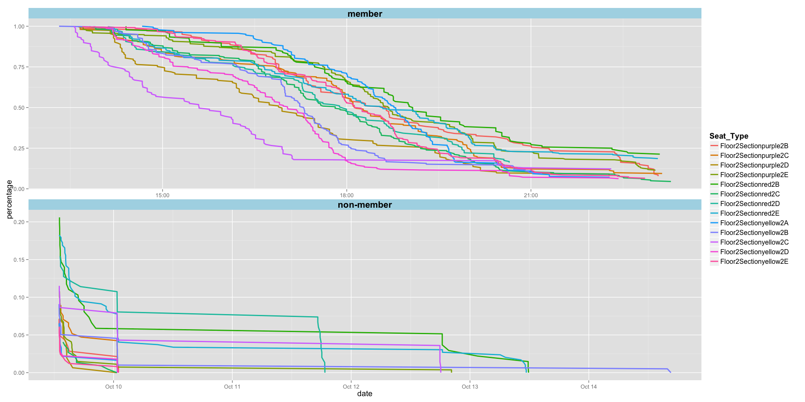
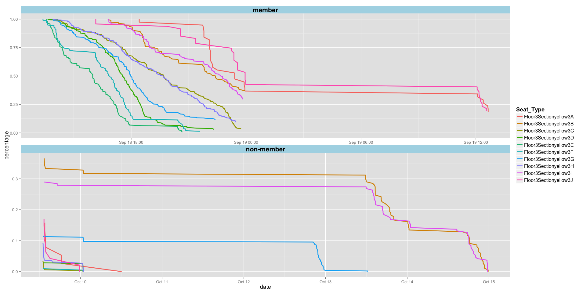
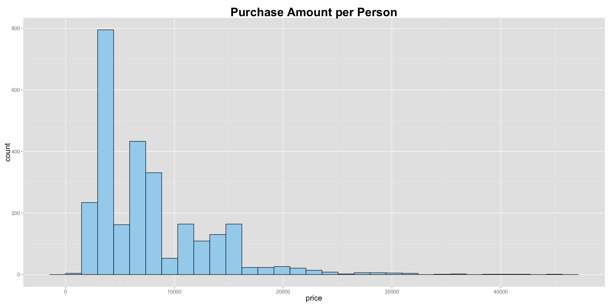

# Exploratory Data Analysis on Ticket System

## Dataset
Into the New World, was the 1st Asia conert tour by the South Korean girl's band, SNSD (Girl Generation). The concert was held at the Taipei Arena in Taiwan on 2010/10/17. This dataset is from the ticket system that was in charge of selling the tickets to that concert. The raw data consists of 7069 rows and 30 variables. 
Each variables has a very descriptive header indicating what the variables mean, so we'll only go through the ones that we will be using in this essay.

- `IDENTITY`: The identity card ID for the person that made the purchase, the last three numbers have been deleted for the sake of customer privacy.
- `CREATE_DATE`: The time when the person made the purchase.(This part should require some cleaning, as it would record 16:00 as 4 p.m., thus we should delete the p.m. and add 12 hours to the timeline that has p.m. in them).
- `T_STANDARD_TICKET_TYPE_NAME`: Indicating whether that person is a member of the ticket system or not.
- `SEAT_REGION_NAME`: Stating the seat section in the Arena for the purchased ticket.
- `SEX` : Quite straightforward, the person's gender.

## Sypnosis
For this essay, we would like to answer two main question.    
1. Look at the timeline of when the tickets were sold, and see if there are differences between member and non-members.     
2. See if there are differences between male and female when it comes to the amount they spent on the tickets.

## Environment Setting

```r
library(plyr)
library(tidyr)
library(ggplot2)
library(data.table)
library(RColorBrewer)
suppressMessages( library(dplyr) )

setwd("C:/Users/ASUS/ticket-system/ticket")
Sys.setlocale("LC_TIME", "English")
```

```
## [1] "English_United States.1252"
```

```r
ticketdata1 <- read.csv( "ticketdata.csv", stringsAsFactors = FALSE )
```
## Data Preprocessing
- The column `CREATE_DATE` is the only column that requires preprocessing, the original format looks something like 2010/10/14 p.m. 11:25:58. Therefore we should turn it into a date, and also add twelve hours to the rows that have p.m. in them. The clean dataset is referred to as `ticketdata2`.

```r
# Step 1 : separate the date row
ticketdata1 <- separate(ticketdata1, CREATE_DATE, into = c( "date1", "date2", "date3" ), sep = " " ) 
# Step 2 : first ignore the p.m. part and create the date 
ticketdata1$my_date <- strptime( paste( ticketdata1$date1, ticketdata1$date3, sep = " " ), 
                                 format = "%Y/%m/%d %H:%M:%S" )  
# Step 3 : add 12 hours(add in unit of seconds) to the data that are in the afternoon (i.e. p.m.)
ticketdata1$my_date[ ticketdata1$date2 == "p.m." ] <- ticketdata1$my_date[ ticketdata1$date2 == "p.m." ] + 12*60*60
# Step 4 : delete the original three columns that were used to create my_date column
# obtain the column num 
which( names(ticketdata1) == "date1" )
```

```
## [1] 8
```

```r
ticketdata2 <- ticketdata1[ -c( 8:10 ) ]
# Step 5 : Change the column names to shorter ones without losing their original descriptive meaning
setnames(ticketdata2, c( "T_STANDARD_TICKET_TYPE_NAME", "SEAT_REGION_NAME" ), c("Ticket_Type", "Seat_Type") )
str(ticketdata2)
```

```
## 'data.frame':	7069 obs. of  30 variables:
##  $ SERIAL_ID               : int  331 332 378 379 586 603 608 609 616 617 ...
##  $ ORDER_ID                : int  26237 26237 24923 24923 24930 26034 23352 23352 23603 23603 ...
##  $ TICKET_ITEM_ID          : int  52196 52195 46903 46902 46919 51814 43680 43678 44220 44219 ...
##  $ PRINT_TIMES             : int  2 2 3 3 4 2 13 12 3 3 ...
##  $ IDENTITY                : chr  "K12197" "K12197" "L22289" "L22289" ...
##  $ PROGRAM_ID              : int  11 11 11 11 11 11 11 11 11 11 ...
##  $ PROGRAM_NAME            : chr  "Girls Generation. THE lst ASIA TOUR Into the new world" "Girls Generation. THE lst ASIA TOUR Into the new world" "Girls Generation. THE lst ASIA TOUR Into the new world" "Girls Generation. THE lst ASIA TOUR Into the new world" ...
##  $ PLAY_DATE               : chr  "2010/10/17" "2010/10/17" "2010/10/17" "2010/10/17" ...
##  $ PLAY_TIME               : chr  "15:00" "15:00" "15:00" "15:00" ...
##  $ TICKET_BOOTH_RUNNING_NUM: int  41139 41138 39579 39580 39596 40890 36400 36398 36939 36938 ...
##  $ PRICE                   : int  1800 1800 1800 1800 1800 1800 3500 3500 3500 3500 ...
##  $ Ticket_Type             : chr  "non-member" "non-member" "member" "member" ...
##  $ Seat_Type               : chr  "Floor3Sectionyellow3I" "Floor3Sectionyellow3I" "Floor3Sectionyellow3C" "Floor3Sectionyellow3C" ...
##  $ FLOOR_NO                : int  1 1 1 1 1 1 1 1 1 1 ...
##  $ SEAT_ROW                : int  11 11 25 25 19 12 11 11 12 12 ...
##  $ SEAT_NO                 : int  10 11 7 6 3 18 10 9 7 8 ...
##  $ TICKET_SHIPPING_RATE_ID : int  4 4 2 2 2 4 2 2 2 2 ...
##  $ TICKET_FEE              : int  50 50 50 50 50 50 50 50 50 50 ...
##  $ SHIPPING_ZIP1           : int  114 114 434 434 201 900 104 104 320 320 ...
##  $ SHIPPING_COUNTRY_ID1    : int  1 1 10 10 2 21 1 1 7 7 ...
##  $ SHIPPING_TOWN_ID1       : int  10 10 129 129 14 295 3 3 75 75 ...
##  $ RECEIPT_TITLE           : chr  "" "" "" "" ...
##  $ SHIPPING_COUNTRY_ID2    : int  5 5 10 10 2 21 1 1 7 7 ...
##  $ SHIPPING_TOWN_ID2       : int  61 61 129 129 14 295 3 3 75 75 ...
##  $ SHIPPING_ZIP2           : int  300 300 434 434 201 900 104 104 320 320 ...
##  $ ORDER_NUM               : int  26237 26237 24923 24923 24930 26034 23352 23352 23603 23603 ...
##  $ TICKET_ENTRANCE_NO      : int  0 0 0 0 0 0 0 0 0 0 ...
##  $ SEX                     : chr  "male" "male" "male" "male" ...
##  $ ADDRESS                 : int  2103 2103 2682 2682 718 765 1199 1199 755 755 ...
##  $ my_date                 : POSIXlt, format: "2010-10-14 23:25:58" "2010-10-14 23:25:58" ...
```

## Question 1 : See how each the tickets of each section were sold out through time, and are there differences in the pattern between those who are members and non-members?
#### 1.1. Select the rows needed and order them by the timeline. 
- `my_date`: Showing the timeline in which the tickets where purchased.
- `Seat_Type`: The floor and the section for that ticket.
- `Ticket_Type`: Indicating whether the purchaser is a member of the ticket system or not.
-  The dataset after this stage is called `ticketdata3`.

```r
# select the columns needed
ticketdata3 <- select( ticketdata2, my_date, Seat_Type, Ticket_Type )
# order by time
ticketdata3 <- ticketdata3[order(ticketdata3$my_date),]
head(ticketdata3)
```

```
##                  my_date             Seat_Type Ticket_Type
## 6431 2010-09-18 13:18:55 Floor2Sectionyellow2B      member
## 6651 2010-09-18 13:22:33  FloorB1FloorSectionA      member
## 6652 2010-09-18 13:22:33  FloorB1FloorSectionA      member
## 6653 2010-09-18 13:22:33  FloorB1FloorSectionA      member
## 6654 2010-09-18 13:22:33  FloorB1FloorSectionA      member
## 953  2010-09-18 13:23:48 Floor3Sectionyellow3F      member
```

#### 1.2. Creating functions.
- `process`: Count every distinct Seat_Type by time. To be explicit, it will show the number of ticket left after each purchases(each type of seat is counted separately).
- `ticketsoldplot`: Plot the graph that shows the pattern for tickets sold in each section through time.  

```r
# process : it does the counting for the ticket left for each Seat_Type
process <- function( dataset )
{
    tickettype <- distinct( select( dataset, Seat_Type ) )
    
    tmp <- vector( mode = "list", length = nrow(tickettype) )
    for( i in 1:nrow(tickettype) )
    {
        data  <- data.frame()
        data  <- subset( dataset, Seat_Type == tickettype[i,] )
        
        data$count <- ( nrow(data)-1 ):0
        tmp[[i]] <- data
    } 
    data1 <- do.call( rbind, tmp )
    data1
} 
# ticketsoldplot : function that does the plotting
ticketsoldplot <- function( dataset )
{
    ggplot( dataset, aes( x = my_date, y = percentage, color = Seat_Type ) ) + geom_line( size = 1 ) +
        facet_wrap( ~Ticket_Type, ncol = 1, scales = "free" ) + xlab( "date" ) + theme(
            strip.text   = element_text( face = "bold", size = 16 ),
            strip.background = element_rect( fill = "lightblue" ),
            axis.title   = element_text( size = 14 ),
            axis.text    = element_text( size = 10 ),
            legend.title = element_text( size = 14 ),
            legend.text  = element_text( size = 12 )) 
}    
```

- `process` the `ticketdata3`, called it `ticketdata4` and write it out.
- This dataset will be used by `image.R`, it will be explained later in the document. 
- Another important step here is, due to fact that the total tickets available for each section are different, therefore we will normalize it to percentage of tickets sold through time by dividing the count with that section's total ticket number. By doing this we will have a clearer picture of which section was sold out more quickly.

```r
ticketdata4 <- process(ticketdata3)
if( !file.exists("processdata.csv") )
{
    write.table( ticketdata4, "processdata.csv", sep = ",", row.names = FALSE )   
}
# percentage of the tickets left for each section
ticketdata4$percentage <- ticketdata4$count/ ( ave(ticketdata4$count, ticketdata4$Seat_Type, FUN = max ) )
head(ticketdata4)
```

```
##                  my_date             Seat_Type Ticket_Type count
## 6431 2010-09-18 13:18:55 Floor2Sectionyellow2B      member   198
## 5002 2010-09-18 14:02:16 Floor2Sectionyellow2B      member   197
## 763  2010-09-18 14:11:25 Floor2Sectionyellow2B      member   196
## 764  2010-09-18 14:11:25 Floor2Sectionyellow2B      member   195
## 6110 2010-09-18 14:13:00 Floor2Sectionyellow2B      member   194
## 6111 2010-09-18 14:13:00 Floor2Sectionyellow2B      member   193
##      percentage
## 6431  1.0000000
## 5002  0.9949495
## 763   0.9898990
## 764   0.9848485
## 6110  0.9797980
## 6111  0.9747475
```
#### 1.3. Plot line graph to see how each section of the tickets were sold out through time. 
- Because there are a total of 27 different seat section, plotting it all in a single graph might be a bit confusing, therefore we split it into three graphs, separating them into the section on Floor 2, Floor 3 and Floor section.


```r
# extract the 3F, 2F and B1 each into one plot
ticketdata4_2f <- ticketdata4[ grep( "Floor([2])+Section.*", ticketdata4$Seat_Type ), ]
ticketdata4_3f <- ticketdata4[ grep( "Floor([3])+Section.*", ticketdata4$Seat_Type ), ]
ticketdata4_B1 <- ticketdata4[ grep( "FloorB1",  ticketdata4$Seat_Type ), ]
```


```r
# plot for the section that are on Floor 2
ticketsoldplot(ticketdata4_2f)
```

 

```r
# plot for the section that are on Floor 3
ticketsoldplot(ticketdata4_3f)
```

 

```r
# plot for the Floor Section
ticketsoldplot(ticketdata4_B1) 
```

 

- **Note1:** The first interesting fact from the graph is that, if you look closely at the timeline of when the tickets were bought, members of the ticket system seems to have had privileges to purchase the tickets before non-members.
- **Note2:** Another thing is, the interval of the timeline for the members are quite short, ending only in a couple of hours, while non-members lasted for days.


#### 1.4. Explanation of image.R 
- What it does is, you pass a specific timeline to the function `image`, and it will print out a graph showing you the total number of seats for each section in the beginning, and the numbers of seats that are still available for each section at the timeline you specified.


```r
# An example of the timeline format is provided below.
timeline <- "2010-09-20 15:11:25"
source("image.R")
image(timeline)
```

 

## Question 2 : How much money do each person spent on buying tickets? Is there a difference between male and female?

#### 2.1. A histgram of the amount of purchases per person
- Calculate the amount of purchase for each person. Save this data to `purchasedata`.

```r
purchasedata <- aggregate( PRICE ~ IDENTITY, ticketdata2, sum )
head(purchasedata)
```

```
##   IDENTITY PRICE
## 1   112522 14000
## 2   123475  5000
## 3   130900  5400
## 4   133062  7000
## 5   213341  3600
## 6   440306  2500
```

```r
ggplot( purchasedata, aes( PRICE ) ) + geom_bar( color = "black", fill = "lightskyblue2", width = 0.8 ) +
    ggtitle( "Purchase Amount per Person" ) + xlab( "price" ) + theme( 
        plot.title = element_text( size = 28, face = "bold" ),
        axis.title = element_text( size = 18 ),
        axis.text  = element_text( size = 12 ))  
```

 
- **Note:** Hmmm.... Most of the customers seems to spent under 10 thousand dollars when purchasing the tickets. Originally, I thought the amount would be bigger, because a lot of people might chose to purchase the tickets together to save the hassle of going through the purchasing process.

#### 2.2. Boxplot of the amount of Purchase per person by gender
- Calculate the amount of purchase for each person, create a new data.frame adding the SEX column and only save the unique rows to `genderdata`.

```r
genderprice <- ave( ticketdata2[,"PRICE"], ticketdata2[,"IDENTITY"], FUN = sum )
genderdata  <- data.frame( identity = ticketdata2$IDENTITY, price = genderprice, gender = ticketdata2$SEX )
genderdata  <- unique(genderdata)
head(genderdata)
```

```
##   identity price gender
## 1   K12197  3600   male
## 3   L22289  3600   male
## 5   C12101  1800   male
## 6   T12237  1800   male
## 7   133062  7000 female
## 9   H22363 10600 female
```

```r
ggplot( genderdata, aes( gender, price, fill = gender ) ) + geom_boxplot() +
    ggtitle( "Amount of Purchase by Gender" ) + theme(
        plot.title   = element_text( size = 24, face = "bold" ),
        axis.title   = element_text( size = 18 ),
        axis.text    = element_text( size = 12 ),
        legend.title = element_text( size = 16 ),
        legend.text  = element_text( size = 14 ))
```

 
- **Note:** From the boxplot, there doesn't seem to be much of a difference between the two genders when it comes to the amount spent on purchasing the tickets. Thought boys would be more fond of this concert, because it is after all Girls Generation. Still, we shouldn't confirm this notion straight away, since we don't know if the person who bought the tickets were actually the ones who went to the concert.

