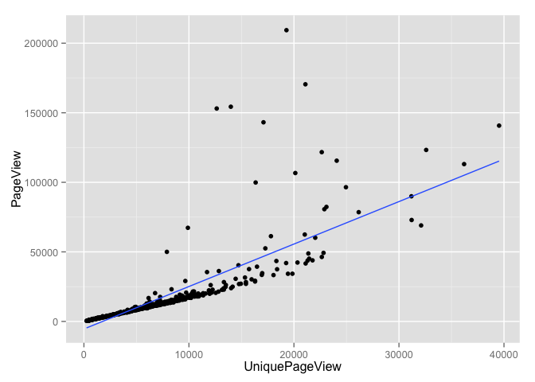
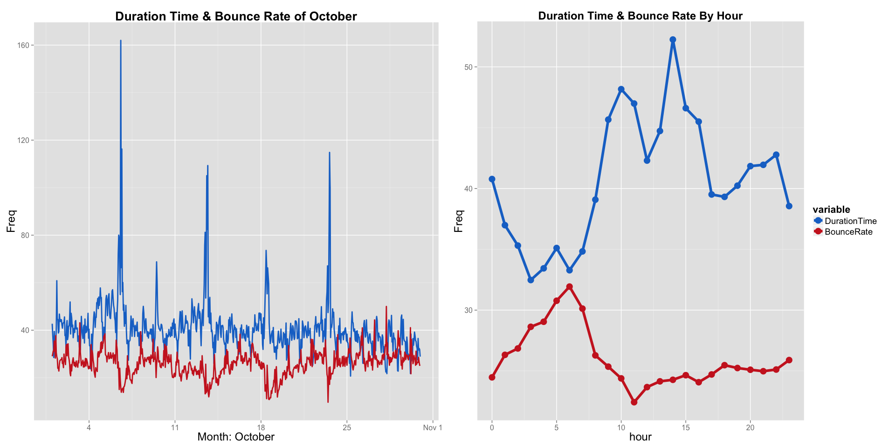

# Exploratory Data Analysis on Webflow

## Background Information
Starting from a couple of years ago, web analytics tools such as Google Analytics have been receiving high attention by large proportions of businesses. Due to fact the more and more businesses are relying on data to make decisions, web analytics allow you to understand more about your customers' behaviors on your site through different types of measurements and reports. The insight you get from these tools can be invaluable in improving your user experiences, maximizing your online marketing and so on.

## Dataset
This dataset comes from the 2010/10/1~ 2010/10/30 Google Analytics report of a ticket system website, this website sells all sorts of tickets ranging from concerts, exhibitions, movies etc. The data consists of six variables.

- `Hour by Day` The date when the measurements were created.
- `Day` The hour when the measurements were created.
- `PageView` The number of times a webpage was viewed, traveling through the same page multiple times in a visit will still counts as one pageview.
- `UniquePageView` The number of individual people, within a designated reporting timeframe, with activity consisting of one or more visits to a site. Each individual is counted only once in the unique visitor measure for the reporting period. Usually used to get a vague idea of the market size of your site, and can also be viewed upon along with conversions, which will reflect the conversion rate of your site.
- `Duration Time` Quite straightforward, the length of time the user spent on your site. Calculation is typically the timestamp of the last activity in the session minus the timestamp of the first activity of the session, recorded in seconds.
- `Bounce Rate` Percentage of single page visits (or web sessions) in which a person leaves your website from the landing page(the first page you come across on the site) without browsing any further. Further note, if the user did not take any action within a certain amount of time, then it will also counts as a bounce(usually 30 minutes). 
- The last four variables are all summations of numbers for all the webpages on the web.
- **Tips:** The clean data should be only 720 rows, the raw data has more than that, and you should simply exclude them. And the `Day` column is messy, the hour should be 0~23 for each day.

## Sypnosis
For this exploratory data analysis, we will be looking at the behaviors of potential customers that browsed this website. The questions that we will be trying to answer are : Are the variables related? If they are then what do these relationships actually mean to the website. **An important thing to note is**, unless you have the webflow data of another ticket system website, then you should not look at these numbers and directly say that the numbers are good or bad. For example: Suppose that the bounce rate for this website is 90%, then in your mind you would probably be thinking "Wow, there must be something wrong with their website, most of users leave without doing anything on the site", but the thing is different types of websites have different bounce rate(e.g. Blogs usually have a bounce rate around 90%, because lots of people come to your site, read your post and leave without clicking anything).


## 1. Environment Settings

```r
# loading the required libraries
library(plyr)
library(grid)
library(ggplot2)
library(reshape2)
library(gridExtra)
suppressMessages( library(dplyr) )
suppressMessages( library(xlsx)  )

# set the working directory
# setlocale , so make sure ouputs related to date are returned in English
setwd("C:/Users/ASUS/ticket-system/webflow")
Sys.setlocale("LC_TIME", "English")
```

```
## [1] "English_United States.1252"
```

## 2. Data Preprocessing
- Read in the files, and take a look at the structure of the data

```r
webflowdata <- read.xlsx2( "webflowdata.xlsx", 2, colClass = c( rep( "numeric", 6 ) ), stringsAsFactors = FALSE ) 
str(webflowdata)
```

```
## 'data.frame':	1345 obs. of  6 variables:
##  $ Hour.by.Day : num  40452 NaN NaN NaN NaN ...
##  $ Hour        : num  0 1 2 3 4 5 6 7 8 9 ...
##  $ PageView    : num  9558 5230 2632 1416 727 ...
##  $ UniqueView  : num  5740 3013 1520 815 447 ...
##  $ DurationTime: num  42.7 38.1 34.3 28.5 39.5 ...
##  $ BounceRate  : num  0.29 0.3 0.312 0.311 0.355 ...
```

- **The preprocessing includes the six following steps**.
- **Step1:** Exclude the data after row 720, they are empty for some unknown reasons.
- **Step2:** Use letters to replace the original column names, for more convenience when calling them. Letter represents: a = Date, b = Hour, c = PageView, d = UniquePageView, e = Duration time, f = Bounce rate.
- **Step3:** The Hour column should be 24 hours a day, but in the data, it seems to be non-endingly adding them. Fix it by filling in the correct hour time.
- **Step4:** Create a sequence of date, and fill in the empty row of the date column
(The raw dataset only has the date value for the first hour on that day).
- **Step5:** Multiply the Bounce Rate column by 100(To allow it to be plotted with duration time, without causing too much scale difference in the plot). So now the number for Bounce Rate means percent, e.g. 42.91, means the bounce rate is 42.91 percent.
- **Step6:** Combine and date and time column, and turn it into a date class column, called `my_date`. The processed dataset is called `data1`.


```r
# The data after processing is referred to as data1
# Step 1
data1 <- webflowdata[(1:720),]
# Step 2
names(data1) <- letters[1:ncol(data1)]
# Step 3
data1$b <- rep( c(0:23), nrow(data1)/24 )
# Step 4
# create a date sequence called my.dates, and fill in the empty date row 
my.dates <- seq( as.Date("2010/10/1"), as.Date("2010/10/30"), "1 day") 
data1$a  <- rep( my.dates, each = 24 )
# Step 5
data1$f <- data1$f *100
# Step 6
data1$my_dates <- paste   ( data1$a, data1$b, sep = "" )
data1$my_dates <- strptime( data1$my_dates, format = "%Y-%m-%d%H" )
# A brief look at the processed data
head(data1)
```

```
##            a b    c    d        e        f            my_dates
## 1 2010-10-01 0 9558 5740 42.72955 29.04671 2010-10-01 00:00:00
## 2 2010-10-01 1 5230 3013 38.07677 29.95050 2010-10-01 01:00:00
## 3 2010-10-01 2 2632 1520 34.27971 31.21693 2010-10-01 02:00:00
## 4 2010-10-01 3 1416  815 28.51545 31.14754 2010-10-01 03:00:00
## 5 2010-10-01 4  727  447 39.49833 35.48387 2010-10-01 04:00:00
## 6 2010-10-01 5  602  357 34.38803 33.73494 2010-10-01 05:00:00
```

## 3. Data Analysis on Pageview and UniquePageview
- For this section we will extract the time, Pageview and UniquePageview column to do some exploratory analysis, calld it `viewdata`. Starting off with its correlation, summaries and scatterplot.

```r
viewdata <- select( data1, my_dates, c , d )
# Correlation between Pageview and UniquePageview
cor(viewdata$c,viewdata$d)
```

```
## [1] 0.7949419
```

```r
# scatter plot
ggplot( viewdata, aes( d, c ) ) + geom_point() + xlab( "UniquePageView" ) + ylab( "PageView" ) + 
    geom_smooth( method = lm, se = FALSE )
```

 

- **Note:** As you can see, it seems like the correlation between Pageview and UniquePageview is quite high(almost at 0.8 to be exact), but a simple scatterplot shows that there are outliers that are extremely obvious, and should receive more attention. 

- After a brief summary below, you can clearly see that the mostly the Pageview value is about 1.8 times higher than the UniquePageview, meaning that on average, the users of this website usually browse about two pages on the site and then leave. 

```r
# A summary on the differences between the two variables
summary( viewdata$c/viewdata$d )
```

```
##    Min. 1st Qu.  Median    Mean 3rd Qu.    Max. 
##   1.447   1.675   1.724   1.872   1.788  12.100
```

- Now we are going to look at the PageView and UniquePageView by their timeline to have a clearer picture on the whole `viewdata`.  
- **There are four major steps for this part.**
- **Step1:** Extract the data that are abnormal, they are used for annotating them in the plot. In this case, I referred to abnormal as being bigger by 8 times(Pageview/Uniquepageview). Called the abnormal data `peak1`.
- **Step2:** Transform the data into long-format to be use by ggplot, called it `viewdata1`. Also filling in the missing value after transforming them(Problems with date type class, it usually works fine with other types of data).
- **Step3:** Renaming the letters to a more descriptive name.
- **Step4:** Create a string called `timestring`. This string Combine the third and fourth row of the abnormal data `peak1`. It will be annotated into the plot, which shows the date and time for one of the peak data.  
- **Step5:** Plot the data in the timeline manner, save the plot to `plot1`.


```r
# Step 1
( peak1 <- viewdata[ viewdata$c/viewdata$d > 8, ] )
```

```
##                my_dates      c     d
## 133 2010-10-06 12:00:00 143142 17098
## 301 2010-10-13 12:00:00 154333 13989
## 421 2010-10-18 12:00:00 209367 19286
## 422 2010-10-18 13:00:00 170466 21090
## 541 2010-10-23 12:00:00 153051 12645
```

```r
# Step 2
viewdata1 <- melt( viewdata, id.vars = "my_dates", value.name = "View", variable.name = "Views" )   
viewdata1$my_dates <- rep( viewdata[ 1:nrow(viewdata), 1 ], 2 )
# Step 3 : plyr revalue function
viewdata1$Views <- revalue( viewdata1$Views, c( "c" = "PageView", "d" = "UniqueView" ) )
head(viewdata1)
```

```
##              my_dates    Views View
## 1 2010-10-01 00:00:00 PageView 9558
## 2 2010-10-01 01:00:00 PageView 5230
## 3 2010-10-01 02:00:00 PageView 2632
## 4 2010-10-01 03:00:00 PageView 1416
## 5 2010-10-01 04:00:00 PageView  727
## 6 2010-10-01 05:00:00 PageView  602
```

```r
# Step 4
datestring <- unlist( strsplit( as.character(peak1[4,1]), split = " " ) )
timestring <- paste( as.character( peak1[3,1]$hour ), "~", datestring[2], sep = "" )
timestring <- paste( datestring[1], timestring ) ; timestring
```

```
## [1] "2010-10-18 12~13:00:00"
```

```r
# Step 5
plot1 <- ggplot( viewdata1, aes( x = my_dates, y = View , color = Views  ) ) + geom_line( size = 1 ) +
           annotate( "text", x = peak1[1,1], y = peak1[1,2]+4*10^3, label = as.character(peak1[1,1]) ) +
           annotate( "text", x = peak1[2,1], y = peak1[2,2]+4*10^3, label = as.character(peak1[2,1]) ) +
           annotate( "text", x = peak1[5,1], y = peak1[5,2]+4*10^3, label = as.character(peak1[5,1]) ) +
           annotate( "text", x = peak1[3,1], y = peak1[3,2]+4*10^3, label = timestring ) +
           annotate( "text", x = peak1[1,1]-30*60*60, y = 10^5, label = ">8", color = "blue", size = 6 ) +
           geom_segment( x = as.numeric( peak1[1,1]-12*60*60 ), xend = as.numeric( peak1[1,1]-12*60*60 ), 
           y = peak1[1,2], yend = peak1[1,3], size = 1, color = "blue", 
           arrow = arrow( ends = "both", angle = 90, length = unit( 0.2, "cm" ) ) ) + 
           ggtitle( "Total PageView of October" ) + xlab( "Month: October" ) + 
           scale_x_datetime( labels = c( "4", "11", "18", "25", "Nov 1" ) ) + theme(
             plot.title = element_text( size = 24, face = "bold" ),
             axis.title = element_text( size = 18 ),
             axis.text  = element_text( size = 12 ),
             legend.position = "none" )  
```

- We will also look at `viewdata` when aggregated by hours.
- **There are two steps for this part.**
- **Step1:** Aggregate the data by each hour. (Calculate the total PageView and UniquePageView for each respective hour), called it `pageviewdata1`.
- **Step2:** Plot the data in the aggregated by hour manner, save the plot to `plot2`.

```r
# Step 1 : 
attach(data1)
pageviewdata  <- aggregate( list( PageView = c, UniqueView = d ), list( hour = b ), FUN = mean )
pageviewdata1 <- melt(pageviewdata, id.vars = "hour", value.name = "View")
head(pageviewdata1)
```

```
##   hour variable       View
## 1    0 PageView 14476.9333
## 2    1 PageView  8034.0667
## 3    2 PageView  4151.2333
## 4    3 PageView  2146.8667
## 5    4 PageView  1286.1667
## 6    5 PageView   862.8667
```

```r
# Step 2 
plot2 <- ggplot(pageviewdata1, aes( x = hour, y = View, color = variable ) ) + geom_line( size = 2 ) + 
           geom_point( size = 5 ) + ggtitle( "Total PageView By Hour" ) + theme(
             plot.title   = element_text( size = 24, face = "bold" ),
             axis.title   = element_text( size = 18 ),
             axis.text    = element_text( size = 12 ),
             legend.title = element_text( size = 16 ),
             legend.text  = element_text( size = 14 )) 
```

- Plot the two plots together

```r
grid.arrange( plot1, plot2, ncol = 2 )
```

 

- **Note1:** Looking at the plot on the left, we can see clearly that there're four major peaks. The date for these peaks are 2010-10-06 12:00:00, 2010-10-13 12:00:00 
2010-10-18 12~13:00:00, 2010-10-23 12:00:00 respectively. After closer look at the timeline when peak appeared, it seems like they all happened to occur around noon, which comes to no surprise that there's also a peak around noon for the aggregated by hour plot on the right.
- **Note2:** We can probably infer from the plot that this ticket system is selling tickets to more popular concerts on 10-06, 10-13, 10-18, 10-23, and the opening time for those tickets all happens to be around noon. Causing the pageview to rise dramatically compared with other timelines(People are clicking more pages on the site when they have to go through the whole process of purchasing the ticket).
- **Note3:** From the Total PageView by Hour of the website on the right, we can tell that the web traffic would start to decrease rapidly around midnight, which matches the life pattern of most people living on planet earth.

## 4. Data Analysis on Duration Time and Bounce Rate
- Basically this part implements the same procedure as the PageView and UniquePageView above.
- `insightdata` Bounce Rate and Duration Time of the whole October.

```r
insightdata  <- select( data1, my_dates, e , f )
# Correlation between Pageview and UniquePageview
cor(insightdata$e,insightdata$f)
```

```
## [1] -0.3699716
```

```r
# scatter plot
ggplot( insightdata, aes( e, f ) ) + geom_point() + xlab( "Duration Time" ) + ylab( "Bounce Rate" )
```

 

- **Note:** Judging from the fact that the correlation between Duration Time and Bounce Rate is only around 0.35, a scatterplot solidify the number, showing that they are no obvious relationships between the two variables.


```r
summary(insightdata$e)
```

```
##    Min. 1st Qu.  Median    Mean 3rd Qu.    Max. 
##   20.71   35.39   39.20   40.73   43.48  162.00
```
- **Note:** The average time that users spent on this website is about 40 seconds. Beware that a high Duration time may also infer that your customers are hesitant on their purchase, or the content/UI of the site tend to be confusing(if coupled with high Bounce Rate or Exit Rate).


```r
summary(insightdata$f)
```

```
##    Min. 1st Qu.  Median    Mean 3rd Qu.    Max. 
##   9.689  23.210  26.430  26.000  28.870  50.000
```
- **Note:** On average, 26 percent of the users left this website without doing any further action.

- In the following section, we are going to look at the Duration Time and Bounce Rate data `insightdata` together by their timeline and when aggregated by hours. Basically it employs the same procedure used with pageviewdata above.
- `insightdata1` Long format of the of `insightdata`.
- `plot3` Plot of `insightdata1`.
- `plotdata` Bounce Rate and Duration Time aggregated by hour.
- `plot4` Plot of `plotdata`.

```r
insightdata1 <- melt( insightdata, id.vars = "my_dates", value.name = "Freq" )   

insightdata1$my_dates <- rep( insightdata[ 1:nrow(insightdata), 1 ], 2 )
insightdata1$variable <- revalue( insightdata1$variable, c( "e" = "DurationTime", "f" = "BounceRate" ) )
head(insightdata1)
```

```
##              my_dates     variable     Freq
## 1 2010-10-01 00:00:00 DurationTime 42.72955
## 2 2010-10-01 01:00:00 DurationTime 38.07677
## 3 2010-10-01 02:00:00 DurationTime 34.27971
## 4 2010-10-01 03:00:00 DurationTime 28.51545
## 5 2010-10-01 04:00:00 DurationTime 39.49833
## 6 2010-10-01 05:00:00 DurationTime 34.38803
```

```r
# plot the whole timeline of the data
plot3 <- ggplot( insightdata1, aes( x = my_dates, y = Freq , color = variable  ) ) + geom_line( size = 1) + 
           ggtitle( "Duration Time & Bounce Rate of October" ) + xlab( "Month: October" ) + 
           scale_x_datetime( labels = c( "4", "11", "18", "25", "Nov 1" ) ) + theme(   
             plot.title   = element_text( size = 20, face = "bold" ),
             axis.title   = element_text( size = 18 ),
             axis.text    = element_text( size = 12 ),
             legend.position = "none" ) + scale_color_manual( values = c( "dodgerblue3", "firebrick3" ) )
```


```r
plotdata  <- aggregate( list( DurationTime = e, BounceRate = f ), list( hour = b ), FUN = mean )
plotdata1 <- melt(plotdata, id.vars = "hour", value.name = "Freq")
head(plotdata1)
```

```
##   hour     variable     Freq
## 1    0 DurationTime 40.77732
## 2    1 DurationTime 36.98546
## 3    2 DurationTime 35.30743
## 4    3 DurationTime 32.47454
## 5    4 DurationTime 33.43666
## 6    5 DurationTime 35.10562
```

```r
# plot the aggregated by hour data
plot4 <- ggplot(plotdata1, aes( x = hour, y = Freq, color = variable ) ) + geom_line( size = 2 ) + 
           geom_point( size = 5 ) + ggtitle("Duration Time & Bounce Rate By Hour") + theme( 
             plot.title   = element_text( size = 18, face = "bold" ),
             axis.title   = element_text( size = 18 ),
             axis.text    = element_text( size = 12 ),
             legend.title = element_text( size = 16 ),
             legend.text  = element_text( size = 14 )) + scale_color_manual( values = c( "dodgerblue3", "firebrick3" ) )         
```


```r
grid.arrange( plot3, plot4, ncol = 2 )
```

 

- **Note1:** The plot may look quite similar to the plot we did with PageView earlier, which has four major peaks. This is not surprising because people on site are going through the process of buying tickets and when people are buying the tickets for concerts or shows that are more popular they often need to wait a little longer than usual for the systm to confirm their purchase.
- **Note2:** The first peak of the Duration Time seems to be extremely high when compared with other peaks, like mentioned before, this may be indicating that there were some problems with the system(e.g. network crashed due to high concurrency).
- **Note3:** Based on the average Bounce Rate for this site is approximately 26 percent , we can see that there are times where the bounce rate seems to get a little bit out of control. Therefore, we should probably look at when exactly did they occurred.


```r
insightdata[ insightdata$f>40, c(1,3) ]
```

```
##                my_dates        f
## 55  2010-10-03 06:00:00 43.11927
## 607 2010-10-26 06:00:00 41.00719
## 631 2010-10-27 06:00:00 44.33962
## 654 2010-10-28 05:00:00 50.00000
## 701 2010-10-30 04:00:00 41.07143
```

- The time resulting of high bounce rate(bigger than 40 in this case) seems to all occur around 6 a.m., but the funny thing is a lot of seems to happening towards the end of the month. As for whether this is the fact worth digging into the reasons behind this is left to be answered by the website itself.


